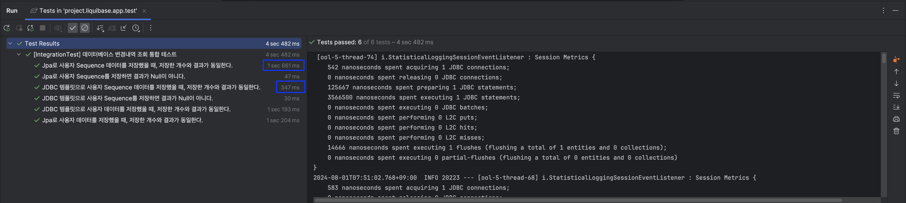

# Sequence Generator

Sequence Generator 예제 레포지토리.

<br/><br/><br/><br/>

## 1. Getting Started

프로젝트 실행 전 .yml 파일을 설정해주세요.

> Java17 / Kotlin1.7 버전 이상의 JDK를 설치해야 합니다.

<br/><br/><br/>

## Run Build

````text
$ ./gradlew build
````

<br/><br/>

## Run Test

````text
$ ./gradlew test
````

<br/><br/><br/><br/>

## 2. Content

Jdbc 템플릿을 사용하면 **`영속성 컨텍스트`** 나 **`프록시 설정/호출`** 과정이 생략되기 때문에 Jpa를 사용할 때보다 INSERT 성능이 좋고, **`Sequence만 저장`** 했을 때가 엔티티의 많은 필드를 영속화할 때보다 성능이 좋을 수 있다.



